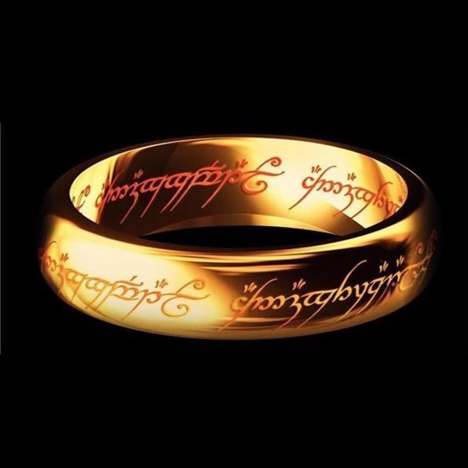
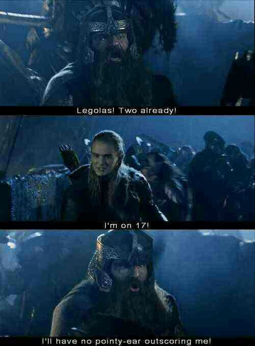
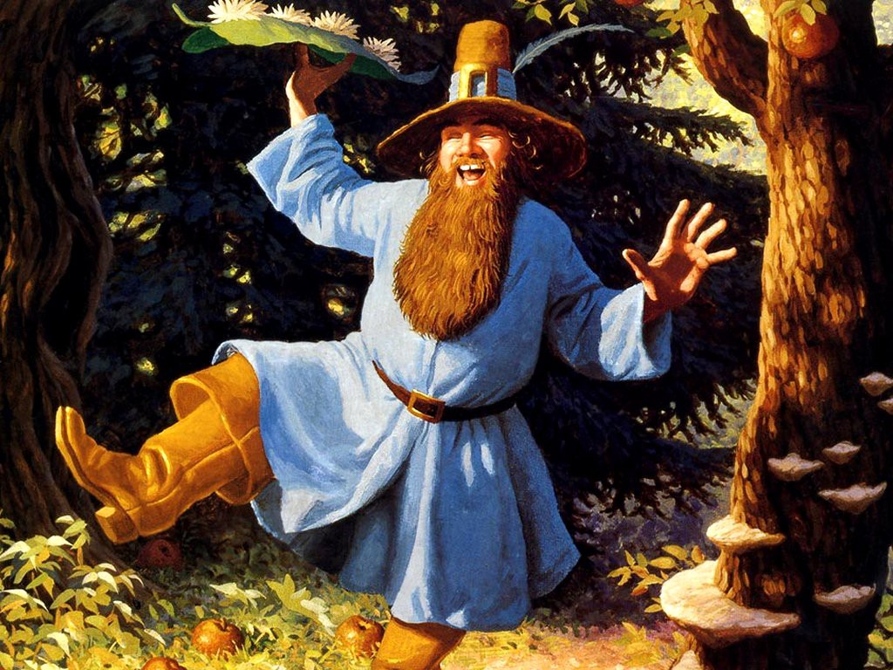
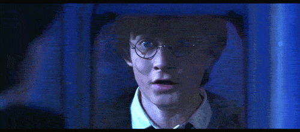
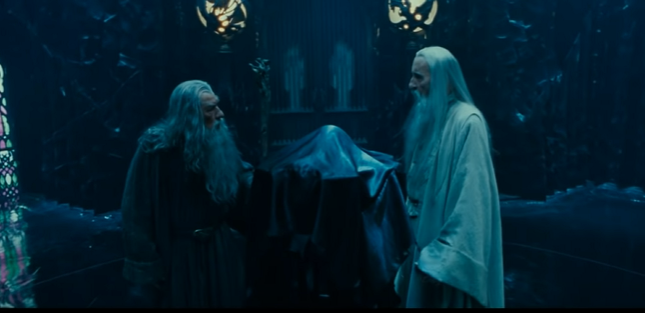

## Category Theory - der Ring sie alle zu knechten
<br><br>
Christian H&ouml;rauf<br>
<sup>@fonzygruen</sup>

Note: 
Heil Sauron,
willkommen zu dieser einmaligen Veranstaltung der Bruderschaft Saurons. Wie sie sicherlich wissen, war Sauron der Herrscher über Mittelerde bis zwei unsägliche Hobbits es wagten seinen Ring der Macht im Schicksalsberg zu zerstören. Peter Jackson hat die Ereignisse seiner Zeit in einer fast 12-Stündigen Dokumentation festgehalten wo sie die Geschehnisse gut nachvollziehen können.

Wie dem auch sei, sie sind heute hier erschienen um die Grundlagen von Saurons Macht kennen zu lernen: die Kategorientheorie. 

Nun ich werde mich bemühen auf die wichtigsten Aspekte einzugehen, jedoch bin ich sicher, dass wir in der kurzen Zeit lediglich die Spitze des Eisbergs streifen können.

??HORIZONTAL

Note:
Uns ist es gelungen, den Menschen Sand in die Augen zu streuen. Sie glauben zu großen Teilen noch heute, dass sie Ihre Magie in kleinsten Schritten wirken und "imperativ" programmieren müssen. So als würden sie auch jeden ihrer Herzschläge bewusst ausführen. Sauron, der letzte der Maia, wäre nie so töhricht gewesen. 

??HORIZONTAL

Note:
Er wuste die abstrakten, arkanen Kräfte zu verstehen und zu lenken. Und genau das gleiche werdet ihr heute auch verstehen lernen.
Jedoch gibt Sauron dieses Wissen nicht einfach so preis. Er will sich Eurer Gefolgschaft sicher sein. Er fordert von Euch den Schwur


??HORIZONTAL
<table border="none">
  <tr>
    <td rowspan="5" valign="middle" style="border-bottom: 0px;">
      
    </td>
    <td style="border-bottom: 0px; text-align: center;">
      
    </td>
    <td rowspan="5" valign="middle" style="border-bottom: 0px;">
      
    </td>
  </tr>
  <tr><td style="border-bottom: 0px;"><div style="font-size: 30px;">Ein Ring, sie zu knechten, <!-- .element: class="fragment" --></div></td></tr>
  <tr><td style="border-bottom: 0px;"><div  style="font-size: 30px;">sie alle zu finden, <!-- .element: class="fragment" --></div></td></tr>
  <tr><td style="border-bottom: 0px;"><div style="font-size: 30px;">ins Dunkel zu treiben <!-- .element: class="fragment" --></div></td></tr>
  <tr><td style="border-bottom: 0px;"><div style="font-size: 30px;">und ewig zu binden. <!-- .element: class="fragment" --></div></td></tr>
</table>


Note:
So sprecht mir also nach:
Ein Ring, sie zu knechten ...
sie alle zu finden, ...
ins Dunkel zu treiben, ...
und ewig zu binden. ...

??HORIZONTAL
Euripides: "Jeder Mann ist wie die Gesellschaft, die er gewöhnlich führt"
Note: 
Nun da Eure Seelen so schwarz sind wie der Schatten Saurons, kann ich Euch verraten: Die wahre Natur der Dinge erkennt man nicht durch die Dinge selbst sondern durch deren Beziehungen zu anderen Dingen. Das ist auch der wesentliche Inhalt der Kategorientheorie.
Wir werden versuchen die Beziehungen zwischen den Objekten aufzudecken und darin Muster wieder zu erkennen versuchen. Was also ist überhaupt eine Kategorie?

??HORIZONTAL
## Kategorie
* Objekte
* Morphismen

Note: 
In der Magie sprechen wir also von Objekten und von Morphismen, welche die Objekte in Beziehung setzen.
Eine Kategorie besteht aus einem Set von Objekten und sog. Morphismen, die die diese Objekte miteinander verbinden. 

??HORIZONTAL
## Kategorie
* Objekte == Datentypen
* Morphismen == Funktionen
Note: 
Eure Mathematiker verwenden diese Termini auch bezogen auf alle möglichen Umstände.  Wie z.B.  die Hirarchie in der Gesellschaft entsteht (Eugenia Cheng). Wir werden uns hier auf auf den Software-Bereich konzentrieren, in dem Objekte Datentypen entsprechen und Morphismen sind die Funktionen, welche von einem Datentyp in einen anderen konvertieren. 

??HORIZONTAL
``` Typescript
const inc = (x: number): number => x + 1;
const isOdd = (value: number): boolean => x % 2 === 1;
```
Note:
Ihr solltet wissen: Macht zeichnet sich nicht dadurch aus, dass man eine große, komplexe Funktion schreibt. Macht bedeutet eine komplexe Funktion aus vielen kleinen überschaubaren Funktionen zusammen zu setzen.

??HORIZONTAL
(isOdd &ordm; inc) (x) = isOdd(inc(x)) 

Note:
Wenn ich also zuerst die Inkrement-Funktion ausführe und dann die isOdd-Funktion, sagt man in der Mathematik
isOdd nach inc.
Für Software-Entwickler lässt es sich eher so verstehen wie auf der Rechten Seite: Inc wird mit der Variablen x aufgerufen und isOdd mit dem daraus resultierenden Ergebnis.

??HORIZONTAL
``` Typescript
const isNextOdd = compose<number, number, boolean>(
  isOdd,
  inc
);
```
Note:
Entsprechend sagen wir im Typescript-Kontext: Die Funktionen inc und isOdd wurden "composed", also kombiniert, zu isNextOdd.
Dieses compose, wie sieht das unter der Haube aus?

??HORIZONTAL
``` Typescript
const compose<T, U, V> = (
  fn1: (input: T) => U, 
  fn2: (input: U) => V
): (input:T) => V {
    return function(value: T) {
        return fn2(fn1(value))
    } 
}
```
Note: 
In einer einfachen Variante dieser Funktion beschränken wir uns darauf, nur zwei Eingabefunktionen zu verwenden. Es gibt jedoch jede Menge Libraries die implemntierungen von Compose anbieten, welche Mehrere Funktionen mit einander verketten können. Das wesentliche was aus dieser einfachen implementierung schließen können ist, dass wir hier als Rückgabe-Parameter eine neue Funktion bekommen. Man spricht hier von einer HigherOrder Function. Diese Funktionen wird beim aufruf die Eingabefunktionen entsprechend aufrufen.

??HORIZONTAL
| Pure          | Impure        |
| ------------- |:-------------:|
| (x) => x + 1  | Math.random() |

Note:
Doch eignet sich nicht jede Funktion für diese Art von Magie. Ihr seit weise beraten wenn ihr nur Funktionen composed die REIN sind. So REIN wie die Herzen der Elben. Sonst wird Euch die Kontrolle entfliehen. Links sehen wir eine Funktion welche bei jedem Aufruf mit dem gleichen Parameter das gleiche Ergebnis liefert. Dies ist eine REINE ( man sagt auch Pure) Funktion. Rechts sehen wir eine Funktion, die vom sog. seed abhängt, quasi einer globalen Variablen welche für gewöhnlich durch einen Timetamp bestimmt wird. Dies nennt man auch Seiteneffekt. Dieser entzieht sich unserer Kontrolle und sollte damit soweit Möglich vermieden werden. 
Aber wir wissen, dass wir keine absolute Kontrolle erlangen können, denn unser Programm soll ja Ausgaben machen und produziert damit zwangsläufig Seiteneffekte.

??HORIZONTAL
## Kategorie
* Objekte == Datentypen
* Morphismen == Funktionen
* Assoziativgesetz
Note: 
 
Um so dringlicher, dass wir alle relevanten Gesetzmäßigkeiten einhalten. Genauer gesagt das sog. Assoziativgesetz. 


??HORIZONTAL
(2 + 3) + 5 = 2 + (3 + 5)
Note:
Die Bruderschaft Saurons weiß, dass ihr Menschen schon längst das Wissen aus Eurer Grundschulzeit verdrängt habt. Zur Erinnerung, das Assoziativgesetz besagt z.B. bei der Addition, dass es keine Rolle spielt welche Summanten ich zuerst miteinandenr verechne, es kommt immer das gleiche heraus. NICHT zu verwechseln mit dem Kommutativgesetz, demzufolge es egal wäre in welcher Reihenfolge die Summanten zu addieren sind.

??HORIZONTAL
 Beispiel Kommutativ gesetzt Nicht auf Funktionen anwendbar

??HORIZONTAL
(f &ordm; g) &ordm; h = f &ordm; (g &ordm; h)
Note:
Bezogen auf das Verknüpfen von Funktionen bedeutet das, dass es wie in diesem Beispiel egal ist ob wir f nach g komponieren und dann h oder ob wir g nach h kommponieren und dieses mit f. In beiden Fällten entsteht die exakt gleiche Funktion. 

??HORIZONTAL
#Ringbesitzer

Sauron ------------>Gollum -----------> Bilbo -------------------> Frodo
       Silmarillion         Der Hobbit         Der Herr der Ringe
                    Gollum --------------------------------------> Frodo
Note:
Oder anders ausgedrückt hätte Peter Jackson sich auch die Trillogie "Der Hobbit" komplett sparen können...

??HORIZONTAL
Note:
Wir haben jetzt gesehen, wie man Funktionen kombinieren und dadurch ersetzen kann. Dadurch dass hier die Assoziativität gilt, können wir mathematisch gesicherte Schlüsse ziehen:


??HORIZONTAL
  
Note:
Z.B. können wir die Aufgabe besser portionieren. Bei eine Unmenge von Orks könnten wir Gimly 20 Orks zuweisen und Legolas 20 andere Orks. Wenn Gimli in 10 Minuten zwei Orks abschlachtet und Legolas 17, dann spielt das für das Gesamtergebnis keine Rolle. Da es sich Wir könnten also für Gimli und für Legolas unterschiedliche Threads anlegen, in denen Sie Orks erledigen. 

??HORIZONTAL

Note:
Oder wir bearbeiten das Problem inkrementell. Wir könnten Gimli vielleicht sogr ein Zeitfenster einrichten, in dem er die Orks nach Wertgegenständen untersucht, während Legolas jeden ankommenden Ork erlegt.


??HORIZONTAL
## Kategorie
* Objekte == Datentypen
* Morphismen == Funktionen
* Assoziativgesetz
* neutrales Element <!-- .element: class="fragment" -->  
Note:
Ein letztes Gesetz fehlt Euch Menschen noch, die Macht Saurons zu verstehen. In einer Kategorie wird ein neutrales Element benötigt. Und wer spielt in Mittelerde eine so neutrale Rolle, dass selbst Peter Jackson ihn noch nicht mal in seiner Dokumentation erwähnt?

??HORIZONTAL
# Tom Bombadil

Note:
Richtig Tom Bombadil, der angeblich schon da war bevor mein Meister Sauron auf den Plan trat - lächerlich. Der angeblich nicht anfällig für die Macht des Rings war - unmöglich. Der stets Pilze konsumierende Nichtsnutz - was auch sonst... Aber gut, auch ihn brauchen wir um eine Kategorie zu konstruieren.

??HORIZONTAL
# 5 + 0 = 5
Note:
Das neutrale Element wirkt sich nicht auf eine Operation aus. So wie sich z.B. auch die Addition mit der 0 nicht auswirkt, bleibt auch die Anwendung einer Identity-Function ohne Folgen: 

??HORIZONTAL
# f &ordm; identity = f
Note:
D.h. eine Funktion f composed mit identity ergibt wieder F

??HORIZONTAL
``` Typescript
function identity<T> (x: T): T {
    return x;
}

const isAlsoOdd = compose(isOdd, identity)
const isAlsoOdd2 = compose(identity, isOdd)
```

Note: 
Oder in der Typescript Variante entpricht identity einer Funktion, die einfach den Wert zurück liefert, den sie übergeben bekommen hat. Wenn wir z.B. also unser isOdd mit identity kombinieren bekommen wir wieder eine Funktion heraus, die exakt das gleiche tut, wie zuvor.

??HORIZONTAL
## NICHT MEIN SCHATZZZ!!!

Note:
Bevor jetzt Eure Augen genauso so groß werden, weil ihr Euch fragt: "Wozu sollte ich so eine nichtsnützige Funktion brauchen?!?" lasst mich noch erwähnen, dass die Römer zwar viel geleistet haben, aber da sie kein neutrales Element wie die Null kannten blieb ihnen das Rechnen mit Unbekannten verborgen. Und wo wären wir heute ohne Algebra?
Ihr werdet die Bedeutung eines neutralen Elements noch zu schätzen lernen...

??HORIZONTAL

Note: 
Kümmert Euch lieber darum, was ihr dem Meister für Wissen vorführen könnt, sobald ihr ihm gegenüber tretet. Dann solltet ihr unbedingt wissen, was ein Monoid ist. 

??HORIZONTAL
# Monoid
* ein Datentyp <!-- .element: class="fragment" -->
* append  <!-- .element: class="fragment" -->
* Assoziativ  <!-- .element: class="fragment" -->
* neutrales Element  <!-- .element: class="fragment" -->
Note:
Ein Monoid ist eine spezielle Ausprägung der Kategorie. Allerdings ist er auf einen Datentypen eingeschränkt und daher binhaltet er auch nur einen Morphismus, also einen Homomorphismus,  den man Append nennt und welcher zwei Instanzen des Datentypes zu einer dritten zusammenfassen kann.

??HORIZONTAL
``` Typescript
interface Monoid<T> {
    append (a: T, b:T): T
    neutral: T;
}
```

Note:
In Typescript kann man das z.B. mit einem Interface abbilden. Was aber besonders hervorsticht ist, dass einen Monoid also immer der Datentyp, als auch die dazugehörige append-Funktion auszeichnet.

??HORIZONTAL
``` Typescript
class Sum implements Monoid<number> {
    append(a: number, b: number) {
        return a + b
    }
    neutral: number = 0
}

const sum = new Sum();
sum.append(3, 4); // 7
assert( sum.append(5, sum.neutral) === 5 );
```
Note:
Beispielsweise gibt es für den Datentyp number den Monoid Sum. Er definiert die append-Methode mit der addition und dem neutralen Element 0;

??HORIZONTAL
``` Typescript
class Multiply implements Monoid<number> {
    append(a: number, b: number ) {
        return a * b
    }
    neutral: number = 1;
}

const mult = new Multiply();
mult.append(3, 4); // 12
assert(mult.append(5, mult.neutral) === 5);
```
Note:
Aber genauso kann man für number auch den Monoid Multiply definnieren. Man beachte, dass hier das neutrale Element eben nicht mehr die 0 ist, sondern die 1.

??HORIZONTAL
``` Typescript
const factorialOf5 = [1,2,3,4,5]
  .reduce(mult.append, mult.neutral) // 120
```
Note:
Daher eignen sich Monoide besonders für das Zusammenführen von Daten.
Die Falt-Operation, in Typescript Arrays eher als reduce bekannt erwartet z.B. genau so eine append-Funktion und ein neutrales Element.

??HORIZONTAL
``` Typescript
const keyValuePairs: [string, number][] = [['a', 1], ['b', 2]];
const object = keyValuePairs.reduce((obj, pair) => {
    if (!obj) {
      obj = {}
    }
    obj[pair[0]] = pair[1]
    return obj;
}, undefined); // {a: 1, b: 2}
```

Note:
Durch das neutrale Element könnt ihr es Euch sparen zwischen einem leeren Element und einem gefüllten Element zu unterscheiden. Ihr müsst einfach nur mit dem richtigen  neutralen Element beginnen und appended es an die Daten die da kommen. 


??HORIZONTAL
``` Typescript
const keyValuePairs: [string, number][] = [['a', 1], ['b', 2]];
const object = keyValuePairs.reduce((obj, pair) => {
    obj[pair[0]] = pair[1]
    return obj;
}, {}); // {a: 1, b: 2}
```

Note:
Vermutlich habt ihr sogar schon mal Monoide on the fly definiert ohne es zu wissen. Hier besteht unser Monoid aus dem Datentyp "Key-Value-Pair" und einer Append-Funktion die aus den Key-Value-Pairs ein Objekt-Literal konstruiert. 
Das neutrale Element ist hier natürlich das leere Objekt. 

??HORIZONTAL
# Polyjuice Portion

Note:
Ah verdammt, falsches Universum, aber richtige Idee. Bei Harry Potter und die Kammer des Schreckens verwandelt sich Harry Potter in Goyle, einem Kumpan seines Erzfeindes Malfoy, um letzteren unbemerkt auszuspionieren. Er schafft das durch den sog. Vielsafttrank, welcher sich neben einigen exotischen Zutaten auch ein Haar desjenigen enthalten muss, in den man sich verwandeln möchte. Wichtig ist hierbei, dass dieses Haar die letzte Zutat ist, die hinzugefügt werden muss. Das ist genau das, was wir von unserer Software-Entwicklung auch wünchen. Durch eine klitzekleine Anpassung kann man völlig unterschiedliche ausprägungen erreichen und große Teile der Software einfach 1 zu 1 wiederverwenden.

??HORIZONTAL
# Monoid
* ein Datentyp
* append  
* Assoziativ  
* neutrales Element  
* ( Kommutativ ) <!-- .element: class="fragment" -->

Note:
Nun ist ein Monoid per definition nicht zwingend kommutativ aber niemand verbietet uns, unseren Monoiden um Kommutativität zu erweitern. Quasi so als hätten wir noch die letzte fehlende Zutat in den Vielsafttrank hinzugefügt damit er wirkt. Das bedeutet, dass wir nicht nur nach belieben uns die Arbeit im Programm einteilen können, wir können nun auch die Reihenfolge ignorieren, in der die Arbeit vollzogen wird. 

??HORIZONTAL
``` Typescript
interface CommutativMonoid<T> extends Monoid<T> {
    sortCriteria (a: T, b:T): -1|0|1 
}
```

??HORIZONTAL
# kommutative Monoiden in der Praxis
* Logging-System <!-- .element: class="fragment" -->
* Graphik-Operationen <!-- .element: class="fragment" -->
* Netzwerk-Operationen
* Event-Streams <!-- .element: class="fragment" -->
* ... <!-- .element: class="fragment" -->

Note:
Wir können uns also wie bereits angedeutet das Assoziativ-Gesetzt zunutze machen um die Abarbeitung eines Programms besser zu steuern, wenn wir uns klar machen was sich alles wie ein Monoid verhält. Ein Datenstrom z.B., einträge in einer Datenbank, Netzwerkzugriffe. 

??HORIZONTAL

Note:
Jetzt wissen wir also was eine Kategorie ist, und welche Regeln erfüllt sein müssen um von einer Kategorie zu sprechen. Sehen wir uns ein paar Beispiele an, wie man solche Beziehungsgeflechte Kategorisiert:

??HORIZONTAL
<table>
  <tr>
    <td style="border-bottom: 0px;">
Initial Object - Sauron
    </td>
    <td style="border-bottom: 0px;">
    &cong; 0
    </td>
  </tr>
</table>
Note:
Nehmen wir zum beispiel unseren großen und furchtgebietenden Meister Sauron, dessen waches Auge alles sieht. Er war es, der die großen Ringe erschuf.
Drei waren den Elben gegeben, sieben den Zwergen und neun den Menschen. Diese Ringe bargen die Stärke jedes Volk zu leiten. Doch sie wurden alle betrogen, denn es wurde noch ein Ring gefertigt. Im Lande Mordor schiedete der Herrscher Sauron heimlich einen Meisterring um alle anderen zu beherrschen. In diesen Ring floß seine bosheit, seine Grausamkeit und sein Wille alles Leben zu unterdrücken.
Von Ihm gehen alle denkbaren Verknüpfungen aus. Keine endet jedoch dort. In der Kategorientheorie spricht man von einem Initialobjekt.

??HORIZONTAL
<table>
  <tr>
    <td style="border-bottom: 0px;">1 &cong; </td>
    <td style="border-bottom: 0px;">
Gollum - Terminal
    </td>
  <tr>
</table>
   
Note:
Ihm Gegenüber steht Gollum, der in seiner Einfallt und Schwäche nicht nur den einen Ring an die unsägichen Hobbits verloren hat, nein auf dem Schicksalsberg hat er den Ring in seiner Gier und Dummheit mit sich in den Tod gerissen.
Alle Pfeile zeigen damit auf ihn und kein weitere Pfeil zeigt von ihm weg. Damit können wir in Terminal Object nenne.

??HORIZONTAL 
# Duality

Note:
An dieser Stelle erkennen wir einen weiteren Teil der arkanen Macht. Aus jeder Struktur von Objekten und Morphismen die wir erkennen können lässt sich auch immer eine Umgekehrte Struktur, eine Co-St  ruktur ermitteln indem man einfach die Pfeile der Struktur umdreht.
So konnten wir z.B. aus dem Initial-Object auch das Terminal-Object ableiten.

??HORIZONTAL
# ProductType -> Frodo und Sam

                      C
                    /  \
                  fst   snd
                  /  |   \
                A - AxB - B

Note:
Ein weiteres Beispiel bieten diese miesen kleinen Hobbitse Frodo und Sam. Man bekommt sie nur im Doppelpack. Klar gelang es einem der Nazghul sie kurzzeitig zu trennen, aber die meiste Zeit weichen Sie keinen Meter voneinander. Man kann sie also als ein eigenes Objekt betrachten, obwohl sie trennbar sind. Man nennt sowas ProductType, weil sich so gewonnene Datentyp-Kompositionen als Mal-Operation betrachten kann. 

??HORIZONTAL
``` Typescript
interface Product <T, U> {
    first (): T;
    second (): U;
}

class Coordinate implements Product <number, number> {
  constructor(private x: number, private y:number) {}
  first() { return this.x }
  second() { return this.y }
}

class LogEntry implements Product <date, string> {
  contructor(private timestamp: date, private message: string) {}
  first() { return this.timestamp }
  second() { return this.message }
}
```
Note:
Ihr kennt so einen Datentyp aus der Schule als Carthesische Koordinaten.

So, was mag wohl herauskommen, wenn man hier die Pfeile umdreht?

TODO: 
Recherchiere nochmal wie sich der ProductType als Mal-Operation darstellen lässt.


??HORIZONTAL
#SUMTYPE
                      
                A - AxB - B
                  \  |   /
                  ?     ?
                    \  /
                      C

Note:
Das Gegenteil des ProductTypes, das CoProduct ist der sog. SumType. Im Gegensatz zum Product wo zwei Objekte gleichzeitig referenziert werden konnten, repräsentiert ein SumType ein Objekt, welches zwei Ausprägungen hat. Gollum ist ein gutes Beispiel dafür, weil er sich immer mit sich selbst unterhält, mal als guter Smeagol mal als böser Gollum. 

??HORIZONTAL
``` Typescript

interface Either <T,U> {
    getValue (): T|U
}

class Left implements Either <number, string> {
    constructor (private value: number) {}
    getValue() {
        return this.value;
    }
}

class Right implements Either <number, string> {
    constructor (private value: string) {}
    getValue() {
        return this.value;
    }
}

function division (a: number, b: number): Either<number, string> {
    if (b === 0) {
        return new Right('Division by zero is invalid!');
    }
    return new Left(a / b);
}

division(12, 3) // Left { value: 4 }

division(12, 0) // Right { value: 'Division by zero is invalid!' }

```


Note:
In der Programmierung spricht man von einem Either


??HORIZONTAL
# &nbsp;
* Datentypen <!-- .element: class="fragment" -->
* 2 Verknüfungen (product sum) <!-- .element: class="fragment" -->
* Assoziativität (sum, product) <!-- .element: class="fragment" -->
* neutrales Element ( 0, 1) <!-- .element: class="fragment" -->
* Distributivität <!-- .element: class="fragment" -->


??HORIZONTAL
# unitärer Ring  <!-- .element: class="fragment" -->
* Datentypen
* 2 Verknüfungen (product sum)
* Assoziativität (sum, product)
* neutrales Element ( 0, 1)
* inverses Element (sum)

??HORIZONTAL
# unitärer Ring
* Datentypen
* 2 Verknüfungen (product sum)
* Assoziativität (sum, product)
* neutrales Element ( 0, 1)
* inverses Element (sum)
* ~~ Kommutativität ~~   <!-- .element: class="fragment" -->
* ~~ Distributivität ~~   <!-- .element: class="fragment" -->


??HORIZONTAL
# unitärer Ring (naja fast)
* Datentypen
* 2 Verknüfungen (product sum)
* Assoziativität (sum, product)
* neutrales Element ( 0, 1)
* inverses Element (sum)
* ~~ Kommutativität ~~   <!-- .element: class="fragment" -->
* ~~ Distributivität ~~   <!-- .element: class="fragment" -->


??HORIZONTAL
# Algebraic Datatypes
* Pairs / Tuples
* Either
* Maybe / Optional <!-- .element: class="fragment" -->
* List <!-- .element: class="fragment" -->
* Promise / Task / Future <!-- .element: class="fragment" -->
* Trees <!-- .element: class="fragment" -->
* ... <!-- .element: class="fragment" -->

Note:
Wir haben also beinahe die gleichen Möglichkeiten für Datentypen wie in der Algebra um Formeln zu definieren. D.h. mit den Möglichkeiten der algebraischen Datentypen können wir so ziemlich alles als Datentypen abbilden was man sich denken kann. Algebraische Datentype verhalten sich quasi wie Container für andere Datentypen, die für den Compiler nachprüfbar bestimmte Grundannahmen über ein Datum ausdrücken. Pairs und Eithers haben wir bereits kennen gelernt.
Maybes werden genutzt um das Vorhanden sein eines Wertes darzustellen. Damit läßt sich an vielen Stellen im Code auf die lästige Null-Prüfung verzichten.
Auch Listen sind ein algebraischer Datentyp, sie beschreiben schlicht den Umstand, dass es von einem Datentyp mehr als nur eine Instanz gibt.
Promises stehen für Werte die irgendwann in der Zukunft verfügbar sein werden.
Trees bilden hirarchische Strukturen ab.
usw usw.


??HORIZONTAL
# Functors

Note:
Ihr Menschen seht also die Macht des Rings manifestiert sich in Form von Algebraischen Datentypen. Jedoch erscheint ein Objekt stets in seinem Inneren verborgen. Wie also damit aggieren?


??HORIZONTAL
# Frodo without Ring
|-----|-----|
| 
Note:
Hier sehen wir Frodo wie er erst noch in der normalen Welt existiert und von einem NazGuhl bedroht wird.
Vor Angst steckt er sich den Ring an den Finger und verschwindet in der normalen Welt, ... 

??HORIZONTAL
# Frodo with Ring

Note:
... aber in einer art Parallelwelt taucht er wieder auf. Dort sind alle Dinge dort wie in der realen Welt, aber die NazGuhl sieht Frodo hier demaskiert als die neun Könige, deren Seelen Sauron einst durch die Ringe in seinen Bann schlug. 

??HORIZONTAL
# Functor

Note:
Das ist auch das was Eure Mathematiker unter einem Funktor verstehen: Das alle Objekte einer Kategory und deren morphismen sich in eine andere Kategory übertragen lassen.  Jedoch müssen eben diese Zusammenhänge, also die Morphismen erhalten bleiben. Das fmap entspricht hier dem Ring

??HORIZONTAL
I) fmap identity = identity<br><br>
II) fmap (f &ordm; g)    = fmap f &ordm; g

Note:
1. Wenn die Identity-Funktion gemapt wird ist das das gleiche wie die identity Funktion
2. Wenn zwei komponierte Funktionenen in die andere Kategory gemappt werden, ist dass das Gleiche wie wenn ich eine gemappte Version von f mit einer gemappten Version von g verknüpfe.

??HORIZONTAL
``` Typescript
const inc = (x) => x + 1;
const isOdd = (x) => x % 2 === 1;

[1,2,3]
  .map(inc)
  .map(isOdd) // ungünstig zweimal über Liste iterriert

```

Note:
Was heißt dass nun für Euch und Eure kleinen miesen Programmierproblemchen...

Wir betrachten wieder unsere inc und unsere isOdd-Funktion. Ich kann beide nacheinander auf meine Eingabemenge anwenden und erhalte mein gewünschtes Ergebnis. Aber seit Euch bewust, Eure Macht ist stets begrenzt. Nutzt Eure Macht weise. Hier würdet ihr unnötig Eure Kraft verschwenden weil ihr zwei mal über die Liste iterieren müsst. 

??HORIZONTAL
``` Typescript
const inc = (x) => x + 1;
const isOdd = (x) => x % 2 === 1;
const isNextOdd = compose(isOdd, inc)
[1,2,3]
  .map(isNextOdd) // liefert das gleiche Ergebnis, aber es muss nur einaml iteriert werden.
```

Note:
Wenn ihr statt dessen aus inc und isOdd wie vorher schon in isNextOdd kombiniert und damit über die Eingangsliste mapped bekommt ihr das gleiche Ergebnis aber es muss nur einmal iteriert werden.

??HORIZONTAL
# Equational Reasoning 
Note:

??HORIZONTAL
Funktoren:
Note:
Welche gesetze gelten für Funktoren zusätzlich?

??HORIZONTAL
Problem:

``` Typescript
[1,2,3].map(inc).map(time2)
```
Note:
Doof - zweimal über liste iteriert. Aber moment mal 
da waren doch noch die Funktor gesetze: Das hieße ja:

[1,2,3].map(inc).map(time2) === [1,2,3].map(compose(time2, inc))


Wie cool ist dass denn. Heißt das ich kann hier mathematisch beweisen, dass meine Performance Optimierung keine Auswirkung hat?

<beweis der funktoren gesetze für Liste>

Bevor ihr mich noch überflügelt mach ich hier schluss...

??HORIZONTAL
## Gollum -> Bilbo -> Frodo
Note:
Oder anders ausgedrückt: Da ich 

??HORIZONTAL
## Kategorie
* Objekte == Datentypen
* Morphismen == Funktionen
* Assoziativgesetz
Note: 

TODO:
Check out fp-ts gibt es dort eine compose funktion die man klauen kann?

Wie sieht vor allem die Typendefinition dafür aus.

Rewrite identity in TypeScript
