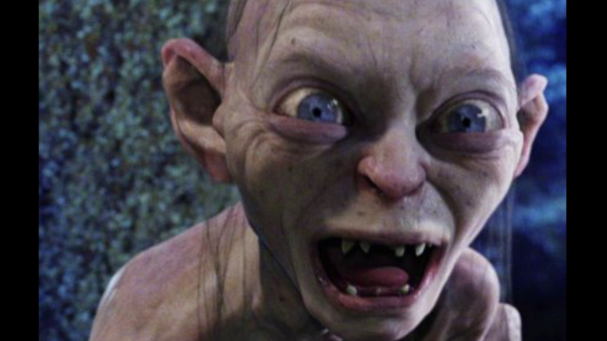

## Category Theory - der Ring sie alle zu knechten
<br><br>
Christian H&ouml;rauf<br>
<sup>@fonzygruen</sup>

Note: Hello welcome to this talk. Before we begin I would like to tell you a little story from

??HORIZONTAL
Note:
Wer von Euch kennt "Der Herr der Ringe"? Wer von Euch mag "Der Herr der Ringe"? Wer von Euch durchblickt die ganze Story?


Eben. 

<!-- ??HORIZONTAL
### Spoiler-Alert
Note:
* Da ist erst mal Bilbo, der in einem frühreren Abenteuer einen ominösen Ring von Gollum geklaut hat
* Weil der Ring ihn Böse macht zwingt ihn der Zauberer Gandalf den Ring an seinen AdoptivSohn Frodo abzutreten
* Sauron, der ursprünglicher Besitzer des Rings und oberster Düsterling der Geschichte, der auch nicht die Ersitzung des Rings (gem# §927 BGB) akzeptiert, weiß inzwischen wer den Ring hat und läßt seine fießen 9 Reiter nach Frodo suchen.

* Gandalf dieses ahnt, schickt er Frodo mit seinen Freunden Sam, Pipin und Merry auf eine tollkühne Reise

* In bruchtal schließen sich ihnen der Zwerg Gimli, der Elf Legolas, und die beiden Menschen Boromir und Aragon an.
* Sie sollen den Ring zum Schicksalsberg nach Mordor, dem direkten Einzugsgebiet Saurons bringen um ihn dort in der Lava des Berges zu zerstören.
* Leider hat sich Saruman der Weise Sauron angeschlossen und zwingt die Gefährten sich durch die Hölen von Moria
* Dort wird vermeintdlich Gandalf von einem Ballrock getötet und kurz darauf Boromir von Orks. So kommt es zum Zerfall der Gemeinschaft. 
-> Frodo und Sam machen sich Richtung Mordor auf
-> -->
??VERTICAL
## Spoiler Alert
Note:
* Sauron, der Oberbösewicht dieser Geschichte, unterwirft mittels eines magischen Rings alle Völker Mittelerdes
*  Isildur, Prinz des Menschengeschlechts, erlangt durch einen Zufall diesen Ring
* Der Ring entzieht sich Isildurs Zugriff und wird von Deagol gefunden
* Smeagol erschlägt Daegol und stiehlt den Ring
* Unter dem Einfluss des Rings wird aus Smeagol Gollum
* Bilbo Beutlin findet den Ring
* Er Schenkt ihn durch Gandalfs überredungskunst seinem Ziehson Frodo
* Gandalf schickt Frodo und seinen Freund Sam los um den Ring in Schicksalsberg in Mordor zu vernichten
* Auf dem Weg dorthin treffen sie auf Gollum, der Ihnen den Ring entwenden will
* Da Frodo zu lange unter dem Einfluß des Ringes stand bringt er es nicht fertig ihn zu vernichten, was dann durch einen dummen Zufall Gollum zuteil wird.


Ende...


??VERTICAL
## ?

Note:
Wer soll das noch kappieren? wir brauchen da erstmal mehr Ordnung. Aber wie können wir das Ding ordnen? Dafür scheint es viel zu komplex. Es sei denn wir finden eine Art arkanes Wissen, eine alte Magie die uns zu Hilfe eilt um dieses Wirrwar zu vereinfachen. 

??VERTICAL
## Vow
* Ein Ring, sie zu knechten, <!-- .element: class="fragment" -->
* sie alle zu finden, <!-- .element: class="fragment" -->
* ins Dunkel zu treiben <!-- .element: class="fragment" -->
* und ewig zu binden. <!-- .element: class="fragment" -->

Note:
Doch bevor ich Euch dieses arkane Wissen zuteil werden lasse, müsst ihr erst auf den Ring schwören. So sprecht mir nach:
Ein Ring, sie zu knechten ...
sie alle zu finden, ...
ins Dunkel zu treiben, ...
und ewig zu binden. ...

??VERTICAL
Euripides: "Jeder Mann ist wie die Gesellschaft, die er gewöhnlich führt"
Note: 
Nun da Eure Seelen so schwarz sind wie der Schatten Saurons, kann ich Euch erklären, was Category Theory, die Macht hinter allem anderen, ist.
Dabei handelt es sich um eine Theorie mathematischer Strukturen. Euripides hat mal gesagt: "Jeder Mann ist wie die Gesellschaft, die er gewöhnlich führt". Das ist auch die Idee, die die Grundlage von CategoryTheory legt. Wenn man ein Objekt einer Kategorie identifizierren möchte betrachtet man das Muster seiner Beziehungen zu anderen Objekten.

??VERTICAL
## Kategorie
* Objekte
* Morphismen

Note: 
Eine Kategorie besteht also aus seinen Objekten und sog. Morphismen, die die verschiedenen Objekte miteinander verbinden. 

??VERTICAL
## Kategorie
* Objekte == Datentypen
* Morphismen == Funktionen
Note: 
Auch wenn Category Theory auf viele verschiedene Gebiete anwendbar ist, für uns Softwareentwickler entsprechen die Objekte einer Kategorie Datentypen und die Morphismen sind die Funktionen die einen konkreten Wert eines Datentyps in den Wert eines anderen Datentypes transformieren. Wenn ich also im weiteren von Objekten spreche meine ich NICHT die Objekte, von denen man in OOP-Sprachen spricht.

??VERTICAL
## Kategorie
* Objekte == Datentypen
* Morphismen == Funktionen
* Assoziativgesetz
Note: 
Dabei gilt für diese Morphismen das Assoziativgesetz.

??VERTICAL
(2 + 3) + 5 = 2 + (3 + 5)
Note:
Zur Erinnerung, das Assoziativgesetz besagt z.B. bei der Addition, dass keine Rolle spielt welche Summanten ich zuerst miteinandenr verechne, es kommt immer das gleiche heraus. NICHT zu verwechseln mit dem Kommutativgesetz, demzufolge es egal wäre in welcher Reihenfolge die Summanten zu addieren sind.

??VERTICAL
(f &ordm; g) &ordm; h = f &ordm; (g &ordm; h)
Note:
Wenn ich also die Funktionen f, g und h habe, dann spielt es keine Rolle ob ich g mit f  verbinde oder ob ich g mit h verbinde. Wenn alle Funktionen ausgeführt werden kommt das gleiche heraus.

??VERTICAL
``` Typescript
function compose<T, U, V> (fn1: (input: T) => U, fn2: (input: U) => V): (input:T) => V {
    return function(value: T) {
        return fn2(fn1(value))
    } 
}

function size (s: string): number { return s.length; }

function isEven(x: number): boolean { return x % 2 === 0; }

const evenSize = compose(size, isEven);
```
Note: Eine solche Verbindung nennt man Funktionskomposition, die eine bessere Code Wiederverwendung gewährleistet, als es Vererbung könnte.
Hier sehen wir eine einfache compose-Funktion mit Typescript geschrieben. Wie man sieht kommen hier generics zum Einsatz. Sobald Eure Programmiersprache Generics anbietet  könnt ihr von Category Theory profitieren. Noch besser sind compose-Funktionen, die beliebig viele Funktionen entgegen nehmen und diese miteinander kombinieren. 

??VERTICAL
gollum -> bilbo -> frodo
gollum -> frodo

Note:
So gesehen hätte man sich auch den Film "Der Hobbit" komplett sparen können. 

??VERTICAL
## Kategorie
* Objekte == Datentypen
* Morphismen == Funktionen
* Assoziativgesetz
* neutrale Element == Identity
Note:
Schließlich brauchen wir ein neutrales Element, welches sich nicht auswirkt.

??VERTICAL
5 + 0 = 5
Note:
Ähnlich der Rolle die die Null bei der Adition einnimmt...

??VERTICAL
8 * 1 = 8
Note:
... der der 1 bei der Multiplikation muss es auch beim verbinden von Funktionen ein Neutrales Element geben:

??VERTICAL
``` Typescript
function identity<T> (x: T): T {
    return x;
}
```
Note:
die Identity-Function, welche nichts weiter tut als ihren Eingabeparameter zurück zu geben.

??VERTICAL
f &ordm; identity = f
Note:
So gilt nun auch, dass f verbunden mit Identity wieder f ergibt.

??VERTICAL
NICHT MEIN SCHATZZZ!!!

Note:
Bevor jetzt Eure Augen genauso so groß werden, weil ihr Euch fragt: "Wozu sollte ich so eine nichtsnützige Funktion brauchen?!?" lasst mich noch erwähnen, dass die Römer zwar viel geleistet haben, aber da sie kein neutrales Element wie die Null kannten blieb ihnen das Rechnen mit Unbekannten verborgen. Und wo wären wir heute ohne Algebra?

??VERTICAL

Note:
Jetzt wissen wir also was eine Kategorie ist, und welche Regeln erfüllt sein müssen um von einer Kategorie zu sprechen. Sehen wir uns ein paar Beispiele an, wie man solche Beziehungsgeflechte Kategorisiert:

??VERTICAL
# Initial Object - Sauron
Note:
Nehmen wir zum beispiel unseren großen und furchtgebietenden Meister Sauron, dessen waches Auge alles sieht. Er war es, der die großen Ringe erschuf.
Drei waren den Elben gegeben, sieben den Zwergen und neun den Menschen. Diese Ringe bargen die Stärke jedes Volk zu leiten. Doch sie wurden alle betrogen, denn es wurde noch ein Ring gefertigt. Im Lande Mordor schiedete der Herrscher Sauron heimlich einen Meisterring um alle anderen zu beherrschen. In diesen Ring floß seine bosheit, seine Grausamkeit und sein Wille alles Leben zu unterdrücken.
Von Ihm gehen alle denkbaren Verknüpfungen aus. Keine endet jedoch dort. In der Kategorientheorie spricht man von einem Initialobjekt.

??VERTICAL
# Gollum - Terminal Object
Note:
Ihm Gegenüber steht Gollum, der in seiner Einfallt und Schwäche nicht nur den einen Ring an die unsägichen Hobbits verloren hat, nein auf dem Schicksalsberg hat er den Ring in seiner Gier und Dummheit mit sich in den Tod gerissen.
Alle Pfeile zeigen damit auf ihn und kein weitere Pfeil zeigt von ihm weg. Damit können wir in Terminal Object nenne.

??VERTICAL 
# Pointerumkehr
Note:
An dieser Stelle erkennen wir einen weiteren Teil der arkanen Macht. Aus jeder Struktur von Objekten und Morphismen die wir erkennen können lässt sich auch immer eine Umgekehrte Struktur, eine Co-St  ruktur ermitteln indem man einfach die Pfeile der Struktur umdreht.
So konnten wir z.B. aus dem Initial-Object auch das Terminal-Object ableiten.

??VERTICAL
# ProductType -> Frodo und Sam
Note:
Ein weiteres Beispiel bieten diese miesen kleinen Hobbits Frodo und Sam. Man bekommt sie nur im Doppelpack. Klar gelang es einem der Nazghul sie kurzzeitig zu trennen, aber die meiste Zeit 

??VERTICAL
## Gollum -> Bilbo -> Frodo
Note:
Oder anders ausgedrückt: Da ich 

??VERTICAL
## Kategorie
* Objekte == Datentypen
* Morphismen == Funktionen
* Assoziativgesetz
Note: 

TODO:
Check out fp-ts gibt es dort eine compose funktion die man klauen kann?

Wie sieht vor allem die Typendefinition dafür aus.

Rewrite identity in TypeScript

??VERTICAL


??VERTICAL
## Agenda
* Extreme Ownership
* Discipline <!-- .element: class="fragment" -->
* The Good Leader <!-- .element: class="fragment" -->
* Decentralized Command <!-- .element: class="fragment" -->
* Prioritize <!-- .element: class="fragment" -->
* Summary <!-- .element: class="fragment" -->